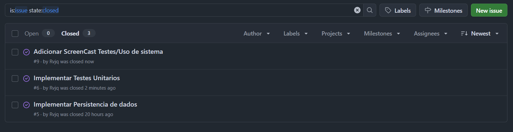

    <h1>
        <b font-size: 20px;>🚀 CondTech 🏢</b>
         
         
        
    </h1>

  
  
  
  

> [!NOTE]
> Projeto em inicio de desenvolvimento, sujeito a mudanças.

---

 

    Condtech é um aplicativo inovador de gerenciamento de condomínios, que centraliza todas as necessidades administrativas em uma plataforma intuitiva. Ele permite comunicação entre moradores e síndicos, controle financeiro, agendamento de manutenções e reservas de espaços, além de oferecer relatórios detalhados e facilitar a gestão de documentos do condomínio. ⚡

## 💪 Nossa Equipe

*👨‍💼 Terry Damasio Santos

*👨‍💻 Rafael Varela Queimado

*👨‍💻 Heitor Santana Freitas Monteiro

*👨‍💻 Kerry Muniz Santos

*👩‍💻 ⁠Maria Júlia de Paula Martins Germano

*👨‍💻 Ricardo Block Veras Franco Neves

*👨‍💻 Gabriel Tenorio

## 🖇️ Entrega 1

<ul>

  <li>
    <a  href="https://www.figma.com/design/aR759HYL8jvVgrsIkYoMP9/Modelo-3C's-CONDTECH?node-id=0-1&t=91KOL9RdbFD0NUyN-1"
      >Histórias de Usuário</a
    >
  </li>

  <li>
    <a  href="https://www.figma.com/design/MQ7tfXz8hMkbnDqvilS433/Untitled?node-id=0-1&t=EY4T2Vp3YjMKr2Vf-1"
      >Prototipo Baixa fidelidade</a
    >
  </li>

  <li>
    <a  href="https://www.figma.com/design/uqvQwAdAEfrFJGFzbhrwY7/Protótipo-Alta-fidelidade?node-id=0-1&p=f&t=FkXipyaQfHtclcc5-0"
      >Prototipo Alta fidelidade</a
    >
  </li>

  <li>
    <a  href="https://youtu.be/hQs_UOytmYM"
      >ScreenCast 1</a
    >
  </li>

</ul>

## 🖇️ Entrega 2

<ul>

  <li>
    <a  href="https://lucid.app/lucidchart/9c625870-c04a-4fed-9088-061c8881d635/edit?viewport_loc=-773%2C-58%2C3631%2C1681%2C0_0&invitationId=inv_02c7b44c-c23f-4ced-99e4-f91deefe201e" 
        >Diagrama de Classes</a
    >
  </li>

  <li>
    <a  href="https://youtu.be/9lmaGdYEhw4"
      >ScreenCast 2</a
    >
  </li>
  
</ul>

## 🖇️ Entrega 3

<ul>

  <li>
    <a  href="https://lucid.app/lucidchart/9c625870-c04a-4fed-9088-061c8881d635/edit?viewport_loc=-773%2C-58%2C3631%2C1681%2C0_0&invitationId=inv_02c7b44c-c23f-4ced-99e4-f91deefe201e" 
        >Diagrama de Classes Atualizado</a
    >
  </li>
 
  <li>
    <a  href="https://youtu.be/NpKR00xoo7Y"
      >ScreenCast 3</a
    >
  </li>
</ul>

## 🖇️ Entrega 4 - 28/05

<ul>

  <li>
    <a  href="https://lucid.app/lucidchart/9c625870-c04a-4fed-9088-061c8881d635/edit?viewport_loc=-85%2C-279%2C3631%2C1681%2C0_0&invitationId=inv_02c7b44c-c23f-4ced-99e4-f91deefe201e" 
        >Diagrama de Classes Atualizado</a
    >
  </li>

  <li>
    <a  href="https://youtu.be/0yYABjT2GVM"
      >ScreenCast Automação de Testes Unitários</a
    >
  </li>

  <li>
    <a  href="https://youtu.be/AMB6TKv1E14"
      >ScreenCast Funcionamento do Software</a
    >
  </li>
  
  <li>
    
Print do Issue/bug tracker

  </li>

  
  
</ul>

# 🚀 Documentação para Executar o Projeto
### 1️⃣ Baixar e instalar os programas necessários

<ul>

  <li>
    <a  href="https://www.oracle.com/java/technologies/javase-downloads.html" 
        >Java JDK (versão 17 ou superior)</a
    >
  </li>

  <li>
    <a  href="https://dev.mysql.com/downloads/"
      >MySQL + MySQL Workbench</a
    >
  </li>

  <li>
    <a  href="https://www.eclipse.org/"
      >IDE para Java (opcional, mas recomendado)
</a
    >
  </li>

</ul>

### 2️⃣ Clonar o repositório do projeto 

#### Utilizar códigos no terminal de comando
git clone https://github.com/seu-usuario/nome-do-repositorio.git
cd nome-do-repositorio

### 3️⃣ Configurar o banco de dados

<ul>

  <li>
    Abra o MySQL Workbench.
  </li>

  <li>
    Crie um banco com o nome "condtech_db"
  </li>

  <li>
    Baixe o arquivo condtech_db.zip que está neste repositório e importe o arquivo no mysql workbench 
  </li>
  
  <li>
    Ajustar credenciais de conexão no código (url, user e passoword)
  </li>
</ul>

#### ✅ Projeto pronto para ser executado 

